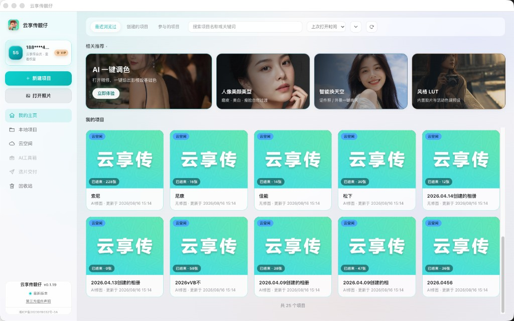
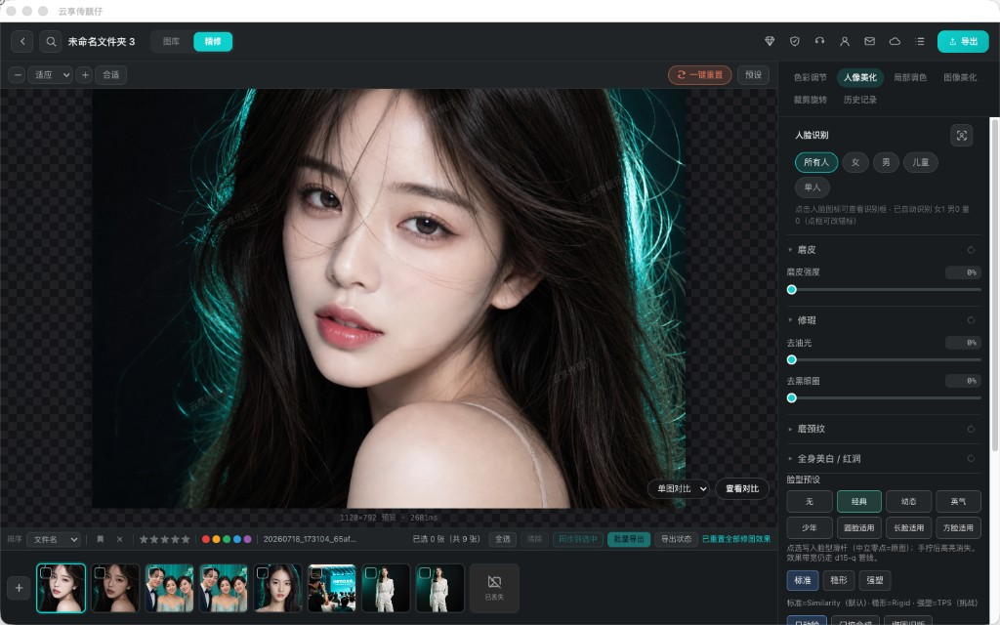
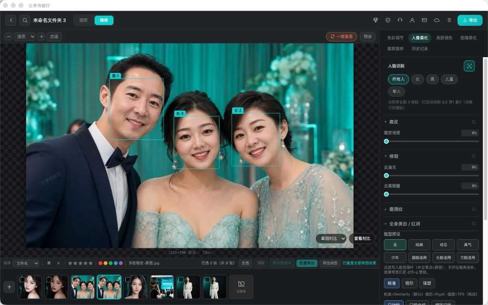
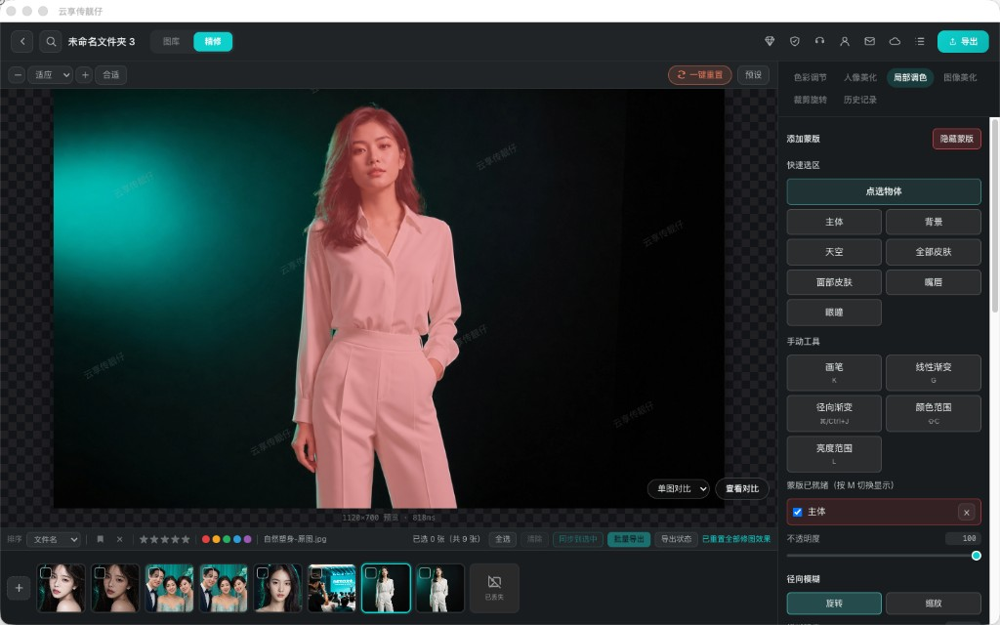
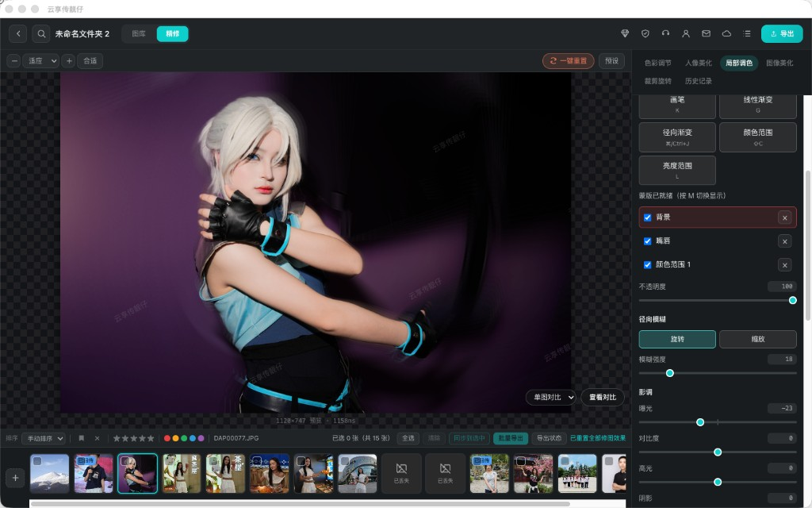
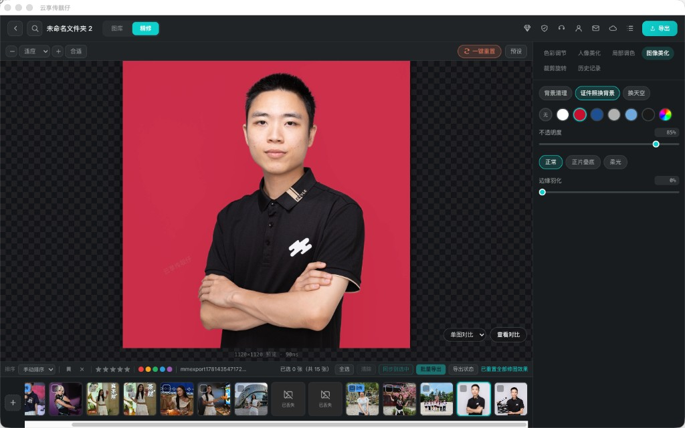
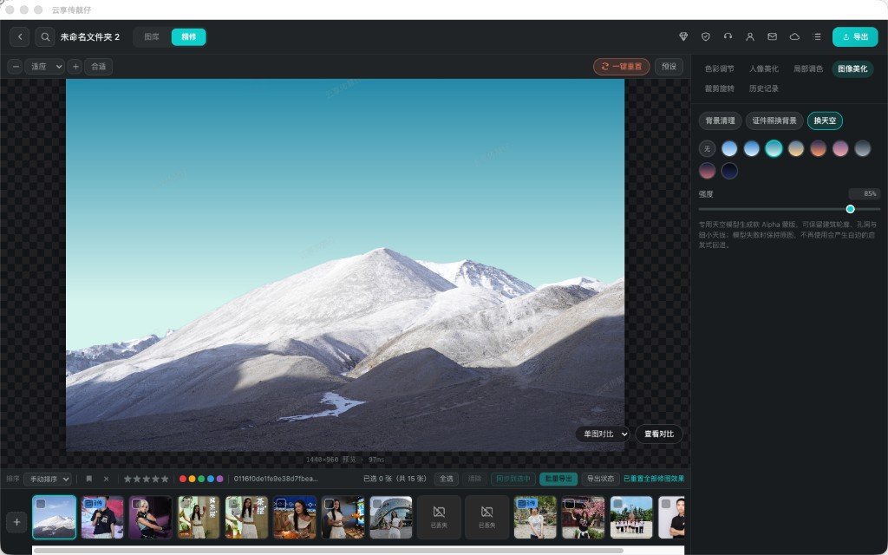
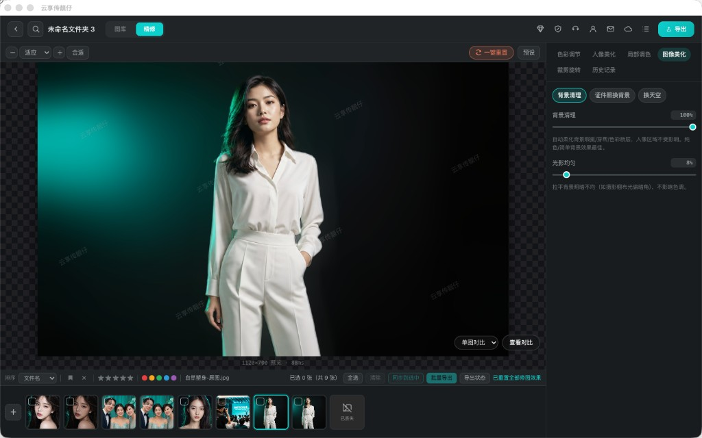
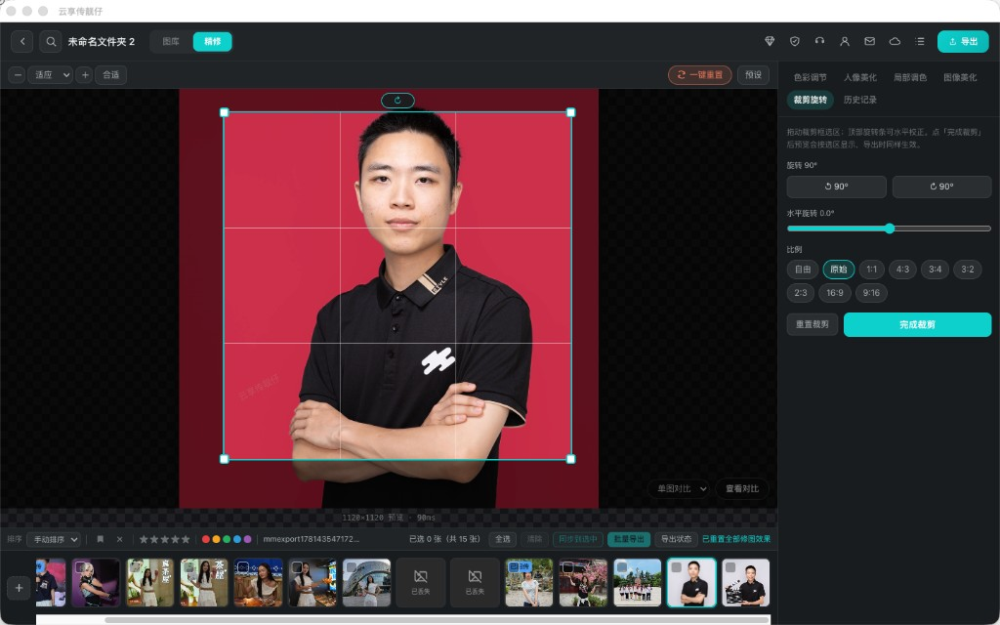
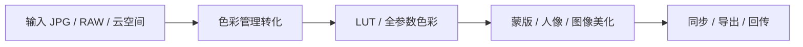

  

<h1 align="center">云享传靓仔</h1>

<b>活动摄影修图美颜软件</b>

<h3 align="center">本机出片。AI 起稿，参数你说了算。</h3>

  婚礼、活动、证件照现场用。 
  像素留在电脑上，弱网也能交片。 
  不是黑盒滤镜——每一项都能回退、微调、铺到整场。

  <a href="https://www.ybpbyxc.com/download.html"><b>下载 Mac / Windows</b></a>
  &nbsp;·&nbsp;
  <a href="https://www.ybpbyxc.com/enterprise.html">私有化 / 二开</a>
  &nbsp;·&nbsp;
  <a href="https://www.ybpbyxc.com">官网</a>

  
  
  
  

  

精修工作台 · AI 一键调色 · 风格 LUT · 曝光到 HSL 都能接着拧

| 像素不上云 | AI 可改 | 一场走完 |
|:---:|:---:|:---:|
| **图必须在本机算** | **回填的是参数，不是烤死的 JPG** | **挑图 → 修 → 同步 → 导出 → 回传** |
| 授权可以短时校验，网一抖整场也不停 | 一键调色只是起点，味道你自己拧 | 不换软件，一条工作台走完 |

本仓库是产品介绍 + 开源周边导航。**核心引擎闭源**，不是全源码开源，没有美颜 / 瘦脸源码可下载。

---

  

一场一个项目。本地文件夹或云空间进来，再进精修。

---

## 和常见做法差在哪

| | 别人常见的做法 | 靓仔 |
|---|---|---|
| 出片 | 图上传云端排队修 | 像素留在本机，弱网也能出片 |
| AI | 黑盒滤镜，改不了 | AI 起稿，参数能回退、微调、复制到整场 |
| 工作流 | 挑图、调色、美颜、换天拆成好几个软件 | 一场婚礼从挑图到导出，一条工作台走完 |

---

## 先看工作台

  

调色 → 人脸 → 蒙版 → 证件照，同一条精修里走完

<table>
  <tr>
    <td align="center" width="50%">
      
        
      <b>人像精修</b>
       
      磨皮、去油光、去黑眼圈、磨颈、美白 / 红润。美型 19 路跟手，合影按人改。
    </td>
    <td align="center" width="50%">
      
        
      <b>合影按人修</b>
       
      自动标女 / 男 / 儿童。作用域可选所有人、某一类、或单人，不会一张脸带动全场。
    </td>
  </tr>
  <tr>
    <td align="center" width="50%">
      
        
      <b>智能蒙版</b>
       
      主体、背景、天空、皮肤、嘴唇、眼瞳一点就拿。画笔、渐变、颜色范围、亮度范围都能再改。
    </td>
    <td align="center" width="50%">
      
        
      <b>局部互不打架</b>
       
      天空单独压、脸单独暖、嘴唇单独修。多层蒙版叠在一起，参数还能回退。
    </td>
  </tr>
  <tr>
    <td align="center" width="50%">
      
        
      <b>证件照换底</b>
       
      白 / 红 / 蓝 / 灰，发丝抠图，不是硬切。透明度和羽化可拖，混合模式可选。
    </td>
    <td align="center" width="50%">
      
        
      <b>换天空</b>
       
      蓝天、晚霞、夜空等预设。建筑和树枝轮廓单独遮罩，少白边。
    </td>
  </tr>
  <tr>
    <td align="center" width="50%">
      
        
      <b>背景清理</b>
       
      压背景脏点，人像区尽量不动。光影均匀可单独加一点。
    </td>
    <td align="center" width="50%">
      
        
      <b>裁剪旋转</b>
       
      自由 / 原图 / 1:1 / 4:3 / 16:9。水平校正跟手，裁完再导出。
    </td>
  </tr>
</table>

---

## 一场图怎么走完

| 01 导入 | 02 挑图 + AI 起稿 | 03 精修 | 04 同步导出 |
|:---|:---|:---|:---|
| 本地文件夹，或 App 相册下到本机 | 闭眼 / 重样 / 糊图先打星旗色标，**不删原图**。一键调色，参数还能改 | 人像、蒙版、换天、裁剪，跟手预览 | 一套参数铺整场，加水印，回传「美颜无水印」 |

<b>人像精修有哪些滑杆</b>

- **磨皮**：脏的、油的、斑的压下去，毛孔和皮肤起伏还在
- **修瑕**：去油光、去黑眼圈；锁骨到下巴单独磨颈
- **美白 / 红润**：和磨皮分开
- **美型 19 路**：瘦脸、下颌、颧骨、太阳穴、小头、下巴、额头、大眼、眼距、开眼角、瘦鼻、鼻梁、鼻长、小嘴、唇厚、嘴角、人中、眉高、眉距
- **脸型预设**：经典 / 幼态 / 英雄 / 少年 / 圆脸 / 长脸 / 方脸
- **作用域**：所有人 / 女 / 男 / 儿童 / 单人
- **瘦身**：瘦身、瘦手臂、瘦大腿、瘦小腿、长腿

<b>PS 全参数有哪些</b>

- 影调：曝光、对比度、高光、阴影、白色、黑色
- 白平衡：色温、色调
- 色彩：自然饱和度、饱和度
- 细节：纹理、清晰度、祛雾
- 进阶：8 段 HSL、曲线、分离调色
- 细项：全局色相、中间调、锐化、降噪、暗角、镜头畸变
- 风格：内置胶片 / 活动预设，强度可拖；标准 <code>.cube</code> 可自带

---

## 零件开源，引擎闭源

| 开源 MIT | 闭源 · 商业授权 |
|---|---|
| [liangzai-cube-kit](https://github.com/18818474455/liangzai-cube-kit) · `.cube` 读写、三线性插值、[在线试跑](https://18818474455.github.io/liangzai-cube-kit/) | 修图引擎、美颜美型、智能蒙版、换天、挑图、风格 LUT |
| [liangzai-plugin-sdk](https://github.com/18818474455/liangzai-plugin-sdk) · 类型与 Hello。正式 App 不加载未签名插件 | 工作空间配方。源码审计只在 NDA 后进行，不卖断核 |
| 教科书级曝光 / 色温（color 库，规划中） | 正式桌面端与模型 |

开源的是通用标准技术；闭源的是独有资产。两者不冲突。

---

## 联系

| | |
|---|---|
| 微信 | `cylbaw` |
| 官网 / 下载 | [ybpbyxc.com](https://www.ybpbyxc.com) · [download](https://www.ybpbyxc.com/download.html) |
| 私有化 / 二开 | [enterprise](https://www.ybpbyxc.com/enterprise.html) |
| 商务 | 007007007@163.com |
| 协议反馈 | xiaopangnanhai@qq.com |
| 公司 | 长沙粤北偏北传媒有限公司 |

本仓库文档 [CC BY 4.0](https://creativecommons.org/licenses/by/4.0/)。开源零件仓仍是 MIT。
