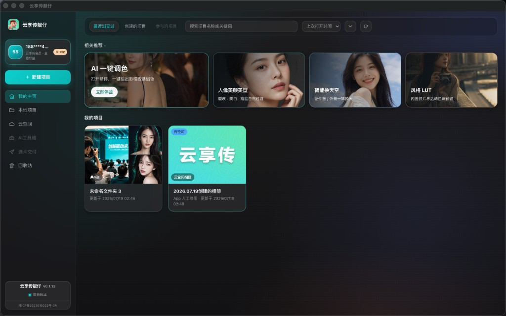
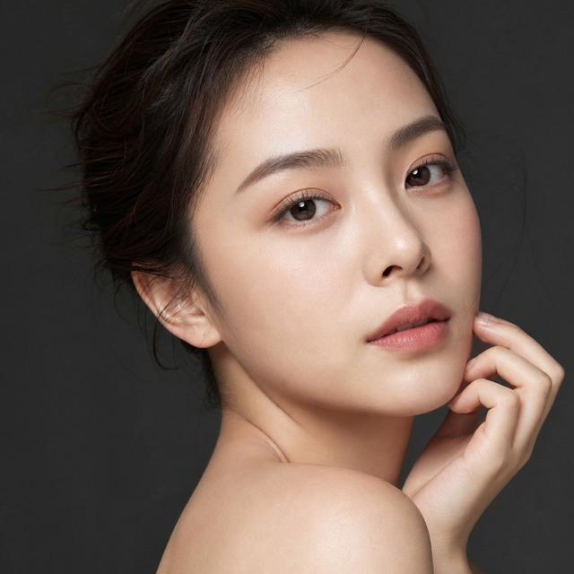
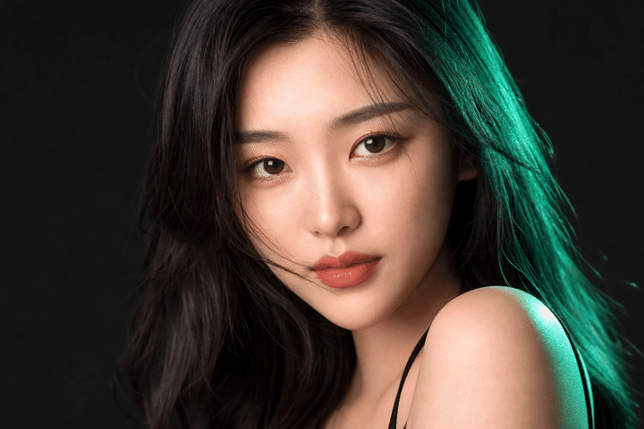
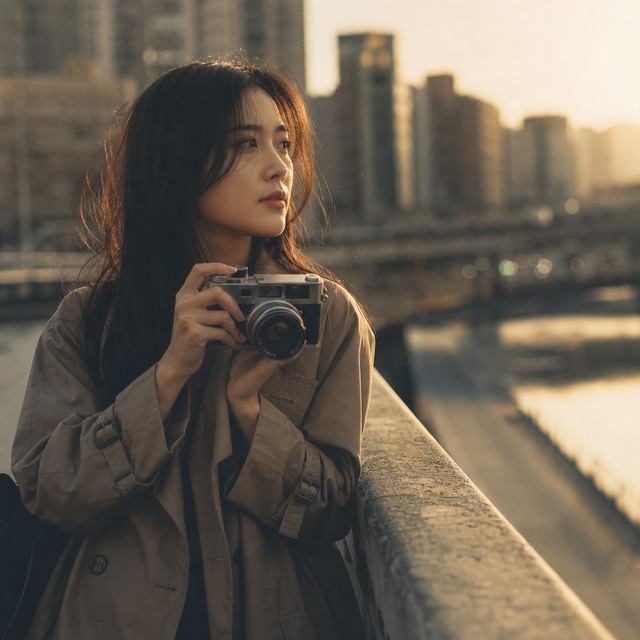
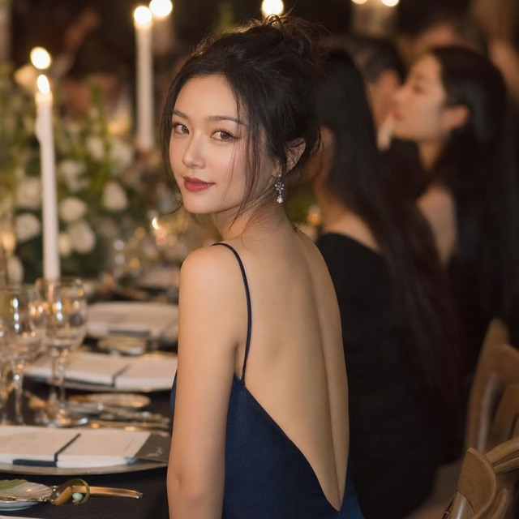
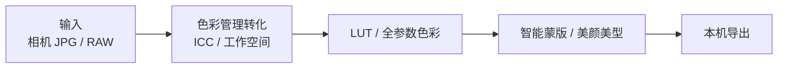

# 云享传靓仔 · 活动摄影修图美颜软件

云享传靓仔是给婚礼、活动、证件照现场用的 **桌面修图美颜软件**：本机出片、预览跟手、像素不上云。  
AI 先把一场图挑完、色起好、脸修好，你再按 Photoshop 那套旋钮把味道拧到自己手里。

本仓库是产品介绍 + 技术架构 + 开源周边导航，**核心引擎闭源**——不是「全源码开源」，也没有美颜源码 / 瘦脸源码可下载。

[官网](https://www.ybpbyxc.com) · [下载试用](https://www.ybpbyxc.com/download.html) · [私有化 / 二开](https://www.ybpbyxc.com/enterprise.html)

---

## 1. 产品是什么

活动现场要马上出片。网一抖、图一上云，整场就停。靓仔把修图放在摄影师自己的电脑上：

- 打开相机 JPG / RAW
- 本机预览、本机成片
- 授权可以短时向服务器要许可，**图必须继续在本机算**

适合婚礼、活动、证件照现场、需要本机滤镜预览的后期台。完整安装包在官网，不在 GitHub 编译。

| 别人常见的做法 | 靓仔 |
|----------------|------|
| 图上传云端排队修 | 像素留在本机，弱网也能出片 |
| AI 是黑盒滤镜，改不了 | AI 起稿，每一项参数都能回退、微调、复制到整场 |
| 挑图、调色、美颜、换天拆成好几个软件 | 一场婚礼从挑图到导出，一条工作台走完 |

---

## 2. 八大能力

下面写的都是正式 App 里已经有的能力。夸的是效果和手感，不给实现、不给模型、不给配方。

### AI 自动挑图

一场婚礼两三千张。闭眼、重样、糊掉的，AI 先打上星标 / 旗标 / 色标，**不删原图**。你只看候选，不像的一键撤回。

技术核：语义看图 + 闭眼检测，写的是标记不是删除。适合活动摄影「先出片、再精修」的节奏。

### 中性灰质感磨皮

不是把脸抹成塑料。思路接近修图师说的中性灰：把脏的、油的、斑的压下去，毛孔和皮肤起伏还在。美白 / 红润另有一层，和磨皮分开拧。

### PS 全参数色彩

打开精修，右边就是摄影师熟悉的那一套，不是「三个滤镜滑杆」：

- 影调：曝光、对比度、高光、阴影、白色、黑色
- 白平衡：色温、色调
- 色彩：自然饱和度、饱和度
- 细节：纹理、清晰度、祛雾
- 进阶：8 段 HSL、曲线、分离调色

AI 一键调色给的是**可回填的参数**，不是一张烤死的 JPG。不满意，接着拖。

### 智能蒙版

局部调色不用自己抠到崩溃。一点就能拿：

- 智能：主体、背景、天空、全身皮肤、脸部皮肤、嘴唇、虹膜
- 手动：画笔、线性 / 径向渐变、颜色范围、亮度范围

天空单独压、脸单独暖、衣服单独降饱和，互不打架。

### 一键换天

证件照、外景、礼堂窗外那块死白天空，选一个天空预设，强度自己拖。发丝和树枝单独做遮罩，不是拿矩形一盖。

### 高级美型

瘦脸、五官、瘦身走网格形变，不是硬拉伸。拖滑杆时画面跟手，松手再出成片。婚礼现场改脸型，不用等「转圈三秒」。

### LUT 色彩

内置胶片和活动色调，标准 Adobe `.cube` 管线，强度可拖。人像上会做保护，避免脸被滤镜染成塑料橘。自己的 `.cube` 也能读——开源零件在 [liangzai-cube-kit](https://github.com/18818474455/liangzai-cube-kit)。

### 色彩管理转化

相机色、屏幕色、导出色不是同一件事。靓仔先做 ICC 边界转换，再进内部工作空间做影调 / LUT / 美颜，最后导回你要的色域。

这就是「色彩管理转化」：不是随便给 JPG 乘一个滤镜，而是 RAW / 相机 JPG 按色彩科学走完再出片。产品工作空间和风格配方闭源；标准 `.cube` 读写开源。

---

## 3. 技术架构

思路级流水线（不提供实现代码、模型权重、风格配方）：

| 段 | 开源还是闭源 | 对应仓库 |
|----|----------------|----------|
| `.cube` 读写、三线性插值 | 开源 MIT | [liangzai-cube-kit](https://github.com/18818474455/liangzai-cube-kit) |
| 教科书级曝光 / 色温 | 开源 MIT | 同上，见 [`src/basic-color.ts`](https://github.com/18818474455/liangzai-cube-kit/blob/main/src/basic-color.ts) 的 `applyExposure` / `applyColorTemperature` |
| 插件类型 / Hello 示例 | 开源 MIT | [liangzai-plugin-sdk](https://github.com/18818474455/liangzai-plugin-sdk) |
| 色彩管理、工作空间、风格 LUT | 闭源 | 正式 App |
| 美颜 / 美型 / 智能蒙版 / 换天 / 挑图 | 闭源 | 正式 App |
| 修图引擎内核 | 闭源 | 正式 App |

教科书级曝光 / 色温已经在 cube-kit 里，不是另开的 color 库。产品 RAW 白平衡、内部工作空间仍闭源。

现场预览怎么跟手、像素为什么不上云：[docs/realtime-preview-outline.md](docs/realtime-preview-outline.md)

---

## 4. 开源组件

| 组件 | 关键词 | 能跑什么 |
|------|--------|----------|
| [liangzai-cube-kit](https://github.com/18818474455/liangzai-cube-kit) | `.cube LUT`、`3D LUT`、`三线性插值`、`批量套 LUT`、教科书级曝光 / 色温 | `npm i liangzai-cube-kit`；LUT 见 `src/cube.ts`，曝光 / 色温见 `src/basic-color.ts`；[在线试跑](https://18818474455.github.io/liangzai-cube-kit/) |
| [liangzai-plugin-sdk](https://github.com/18818474455/liangzai-plugin-sdk) | 插件类型、工作流约定 | `npm start` 跑 Hello；正式 App 不加载 |

没有第三个「color 颜色科学库」仓库。色温 / 曝光的开源实现就在 cube-kit。

开源的永远是通用标准技术；闭源的永远是独有资产。两者不冲突。

---

## 5. 开闭源声明

| 开源（零件仓 MIT） | 闭源（商业授权） |
|---|---|
| `.cube` LUT 读写 + 三线性插值（cube-kit） | 修图引擎内核 |
| 教科书级曝光 / 色温（cube-kit `basic-color.ts`） | AI 模型（美颜 / 瘦脸 / 风格迁移 / 挑图 / 换天） |
| 插件 SDK / 公开类型 | 产品风格 LUT / 调色配方 / 工作空间 |
| 通用算法思路（插值 / 滤波 / 形变） | 正式 App |

源码审计只在 NDA 后进行。交付是安装包 + 培训 + 改壳，不卖断核。

---

## 6. 联系方式

| 项 | 内容 |
|----|------|
| **微信** | `cylbaw` |
| 官网 | https://www.ybpbyxc.com |
| 下载 | https://www.ybpbyxc.com/download.html |
| 合作 / 私有化 | https://www.ybpbyxc.com/enterprise.html |
| 商务邮箱 | 007007007@163.com |
| 协议反馈 | xiaopangnanhai@qq.com |
| 公司 | 长沙粤北偏北传媒有限公司 |

---

本仓库文档使用 [CC BY 4.0](./LICENSE)。开源零件仓仍是 MIT。
