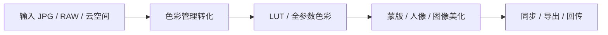

  

<h1 align="center">云享传靓仔</h1>

<b>活动摄影修图美颜软件</b>

<h3 align="center">本机出片。AI 起稿，参数你说了算。</h3>

  婚礼、活动、证件照现场用。 
  像素留在电脑上，弱网也能交片。 
  不是黑盒滤镜——每一项都能回退、微调、铺到整场。

  <a href="https://www.ybpbyxc.com/download.html"><b>下载 Mac / Windows</b></a> ·
  <a href="https://www.ybpbyxc.com/enterprise.html">私有化 / 二开</a> ·
  <a href="https://www.ybpbyxc.com">官网</a>

  

| 像素不上云 | AI 可改 | 一场走完 |
|:---:|:---:|:---:|
| **图必须在本机算** | **回填的是参数，不是烤死的 JPG** | **挑图 → 修 → 同步 → 导出 → 回传** |
| 授权可以短时校验，网一抖整场也不停 | 一键调色只是起点，味道你自己拧 | 不换软件，一条工作台走完 |

---

## 和常见做法差在哪

| | 别人常见的做法 | 靓仔 |
|---|---|---|
| 出片 | 图上传云端排队修 | 像素留在本机，弱网也能出片 |
| AI | 黑盒滤镜，改不了 | AI 起稿，参数能回退、微调、复制到整场 |
| 工作流 | 挑图、调色、美颜、换天拆成好几个软件 | 一场婚礼从挑图到导出，一条工作台走完 |

本仓库是产品介绍 + 开源周边导航。**核心引擎闭源**，不是全源码开源，没有美颜 / 瘦脸源码可下载。

---

## 先看效果

四件事，决定现场能不能交片。

### 1. PS 全参数色彩

曝光、对比、高光阴影、色温、自然饱和度、纹理清晰度、8 段 HSL、曲线、分离调色。  
AI 一键调色给的是可回填参数，不满意接着拖。

  

<table>
  <tr>
    <td align="center" width="50%">
      
        
      <b>2. 人像精修</b>
       
      中性灰质感磨皮、去油光、去黑眼圈、磨颈、美白 / 红润。 
      美型 19 路跟手，合影还能按人改。瘦身、瘦手臂、长腿分开拧。
    </td>
    <td align="center" width="50%">
      
        
      <b>3. 换天 / 证件照</b>
       
      蓝天、晚霞、夜空等预设，发丝和树枝单独遮罩。 
      证件照换白 / 红 / 蓝 / 灰，发丝抠图，不是硬切。
    </td>
  </tr>
  <tr>
    <td align="center" width="50%">
      
        
      <b>4. LUT 色彩</b>
       
      胶片和活动预设，强度可拖，人脸有保护。 
      标准 <code>.cube</code> 可自带，读写在开源 <a href="https://github.com/18818474455/liangzai-cube-kit">cube-kit</a>。
    </td>
    <td align="center" width="50%">
      
        
      <b>色彩管理 · RAW</b>
       
      ICC 进工作空间再出片，不是给 JPG 乘一层滤镜。 
      RAW 可先看机内直出，或走本机显影。
    </td>
  </tr>
</table>

---

## 一场图怎么走完

| 01 导入 | 02 挑图 + AI 起稿 | 03 精修 | 04 同步导出 |
|:---|:---|:---|:---|
| 本地文件夹，或 App 相册下到本机 | 闭眼 / 重样 / 糊图先打星旗色标，**不删原图**。一键调色，参数还能改 | 人像、蒙版、换天、裁剪，跟手预览 | 一套参数铺整场，加水印，回传「美颜无水印」 |

还做了这些（正式 App 已开）：

| 智能蒙版 | 图库与导出 |
|---|---|
| 主体、天空、皮肤、嘴唇、虹膜一点就拿 | 星标 / 旗标 / 色标；回收站只藏记录，**不删磁盘照片** |
| 画笔、线性 / 径向渐变、颜色范围、亮度范围 | 批量导出：整场同一套，或每张再跑一遍智色 |
| 天空单独压、脸单独暖，互不打架 | 水印工作室、建册邀请同事、历史记录 ⌘Z |

<b>人像精修有哪些滑杆</b>

- **磨皮**：脏的、油的、斑的压下去，毛孔和皮肤起伏还在
- **修瑕**：去油光、去黑眼圈；锁骨到下巴单独磨颈
- **美白 / 红润**：和磨皮分开
- **美型 19 路**：瘦脸、下颌、颧骨、太阳穴、小头、下巴、额头、大眼、眼距、开眼角、瘦鼻、鼻梁、鼻长、小嘴、唇厚、嘴角、人中、眉高、眉距
- **脸型预设**：经典 / 幼态 / 英雄 / 少年 / 圆脸 / 长脸 / 方脸
- **作用域**：所有人 / 女 / 男 / 儿童 / 单人，合影不会一张脸带动全场
- **瘦身**：瘦身、瘦手臂、瘦大腿、瘦小腿、长腿

<b>PS 全参数有哪些</b>

- 影调：曝光、对比度、高光、阴影、白色、黑色
- 白平衡：色温、色调
- 色彩：自然饱和度、饱和度
- 细节：纹理、清晰度、祛雾
- 进阶：8 段 HSL、曲线、分离调色
- 细项：全局色相、中间调、锐化、降噪、暗角、镜头畸变

---

## 零件开源，引擎闭源

| 开源 MIT | 闭源 · 商业授权 |
|---|---|
| [liangzai-cube-kit](https://github.com/18818474455/liangzai-cube-kit) · `.cube` 读写、三线性插值、教科书级曝光 / 色温 | 修图引擎、美颜美型、智能蒙版、换天、挑图、风格 LUT |
| [liangzai-plugin-sdk](https://github.com/18818474455/liangzai-plugin-sdk) · 类型与 Hello。正式 App 不加载 | 工作空间配方。源码审计只在 NDA 后进行，不卖断核 |

开源的是通用标准技术；闭源的是独有资产。两者不冲突。

---

## 联系

| | |
|---|---|
| 微信 | `cylbaw` |
| 官网 / 下载 | [ybpbyxc.com](https://www.ybpbyxc.com) · [download](https://www.ybpbyxc.com/download.html) |
| 私有化 / 二开 | [enterprise](https://www.ybpbyxc.com/enterprise.html) |
| 商务 | 007007007@163.com |
| 协议反馈 | xiaopangnanhai@qq.com |
| 公司 | 长沙粤北偏北传媒有限公司 |

本仓库文档 [CC BY 4.0](./LICENSE)。开源零件仓仍是 MIT。
