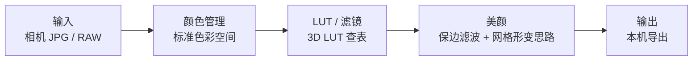

# 云享传靓仔 · 活动摄影修图美颜软件

云享传靓仔是给婚礼、活动、证件照现场用的 **桌面修图美颜软件**：本机出片、预览跟手、像素不上云。  
本仓库是产品介绍 + 技术架构 + 开源周边导航，**核心引擎闭源**——不是「全源码开源」，也没有美颜源码 / 瘦脸源码可下载。

[官网](https://www.ybpbyxc.com) · [下载试用](https://www.ybpbyxc.com/download.html) · [私有化 / 二开](https://www.ybpbyxc.com/enterprise.html)

---

## 1. 产品是什么

活动现场要马上出片。网一抖、图一上云，整场就停。靓仔把修图放在摄影师自己的电脑上：

- 打开相机 JPG / RAW
- 本机预览、本机成片
- 授权可以短时向服务器要许可，**图必须继续在本机算**

适合婚礼、活动、证件照现场、需要本机滤镜预览的后期台。完整安装包在官网，不在 GitHub 编译。

---

## 2. 技术架构

思路级流水线（不提供实现代码、模型权重、风格配方）：

| 段 | 开源还是闭源 | 对应仓库 |
|----|----------------|----------|
| `.cube` 读写、三线性插值 | 开源 MIT | [liangzai-cube-kit](https://github.com/18818474455/liangzai-cube-kit) |
| 教科书级曝光 / 色温 | 开源 MIT | 同上 |
| 插件类型 / Hello 示例 | 开源 MIT | [liangzai-plugin-sdk](https://github.com/18818474455/liangzai-plugin-sdk) |
| 颜色管理边界、工作空间、风格 LUT | 闭源 | 正式 App |
| 美颜 / 瘦脸模型与调参 | 闭源 | 正式 App |
| 修图引擎内核 | 闭源 | 正式 App |

---

## 3. 技术亮点

只讲思路和效果，不给实现：

- **本机实时预览**：拖动时保旧帧、代理分辨率跟手，松手再升档。像素留在本机。
- **标准 3D LUT 管线**：Adobe `.cube` + 三线性插值，这一层已经开源。
- **美颜思路**：保边滤波 + 网格形变。模型权重和调优参数不公开。
- **色彩空间**：按标准做边界转换。内部工作空间与产品配方不公开。
- **现场不断网契约**：短时离线仍能出片，不做成「每张图都上传」。

更细的拆解提纲：[docs/realtime-preview-outline.md](docs/realtime-preview-outline.md)

---

## 4. 开源组件

| 组件 | 关键词 | 能跑什么 |
|------|--------|----------|
| [liangzai-cube-kit](https://github.com/18818474455/liangzai-cube-kit) | `.cube LUT`、`3D LUT 颜色查找表`、`三线性插值`、`批量套 LUT` | `npm i liangzai-cube-kit`，[在线试跑](https://18818474455.github.io/liangzai-cube-kit/) |
| [liangzai-plugin-sdk](https://github.com/18818474455/liangzai-plugin-sdk) | 插件类型、工作流约定 | `npm start` 跑 Hello；正式 App 不加载 |
| color 颜色科学库 | `白平衡算法`、`色温算法` | 规划中，标准公式，不拆产品 RAW 白平衡 |

开源的永远是通用标准技术；闭源的永远是独有资产。两者不冲突。

---

## 5. 开闭源声明

| 开源（MIT） | 闭源（商业授权） |
|---|---|
| `.cube` LUT 读写工具（cube-kit） | 修图引擎内核 |
| 教科书级曝光 / 色温 / 插值 | AI 模型（美颜 / 瘦脸 / 风格迁移） |
| 插件 SDK / 公开类型 | 产品风格 LUT / 调色配方 |
| 通用算法思路（插值 / 滤波 / 形变） | 正式 App |

源码审计只在 NDA 后进行。交付是安装包 + 培训 + 改壳，不卖断核。

---

## 6. 联系方式

| 项 | 内容 |
|----|------|
| **微信** | `cylbaw` |
| 官网 | https://www.ybpbyxc.com |
| 下载 | https://www.ybpbyxc.com/download.html |
| 合作 / 私有化 | https://www.ybpbyxc.com/enterprise.html |
| 商务邮箱 | 007007007@163.com |
| 协议反馈 | xiaopangnanhai@qq.com |
| 公司 | 长沙粤北偏北传媒有限公司 |
