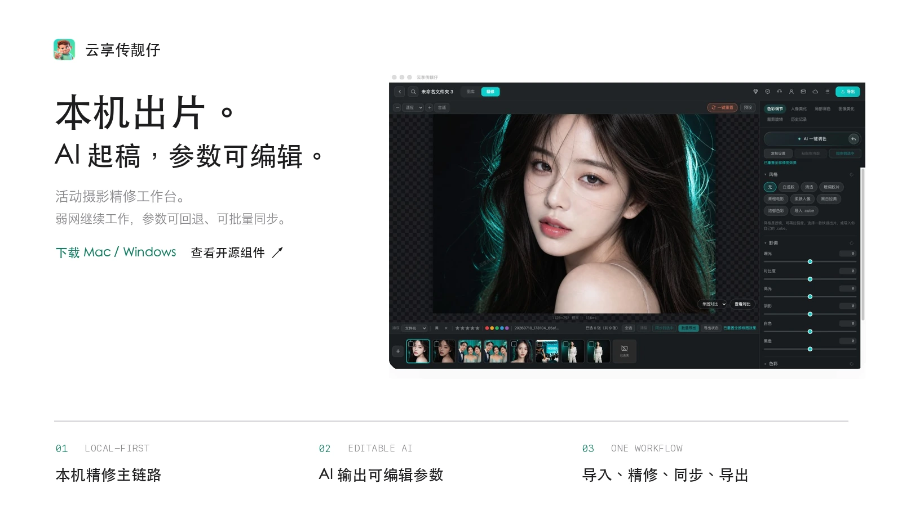
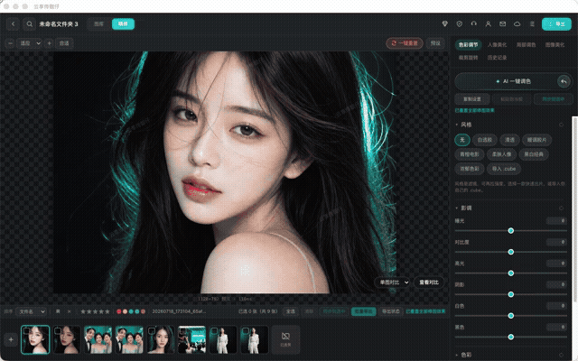
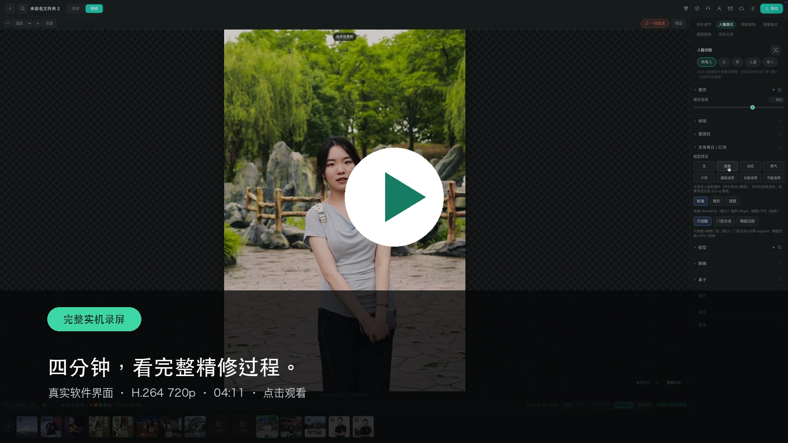
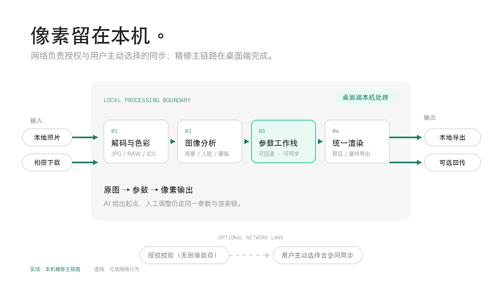
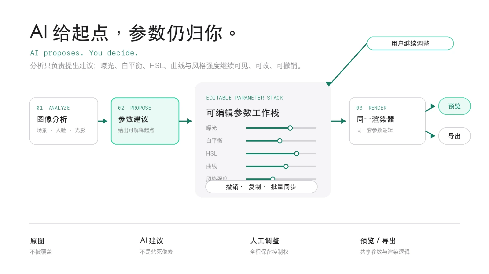
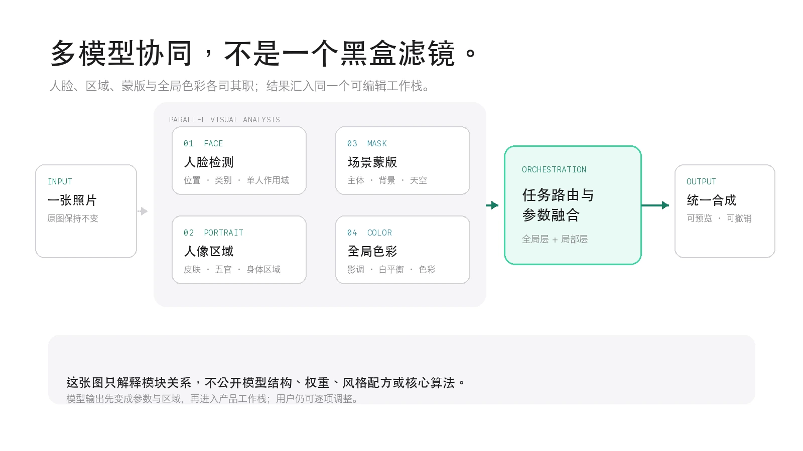
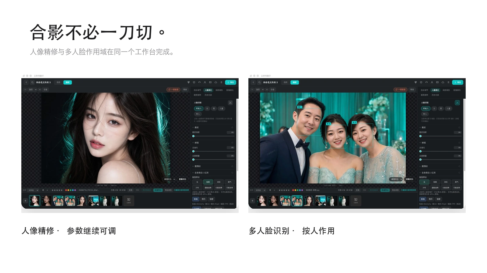
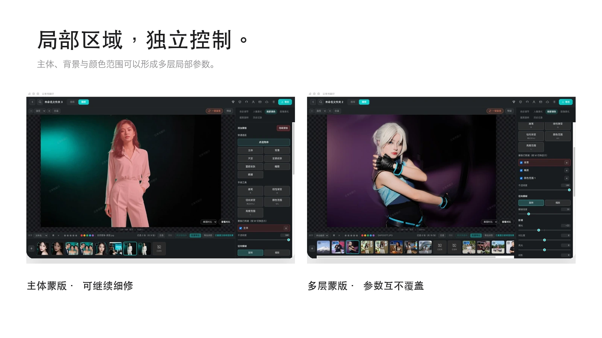
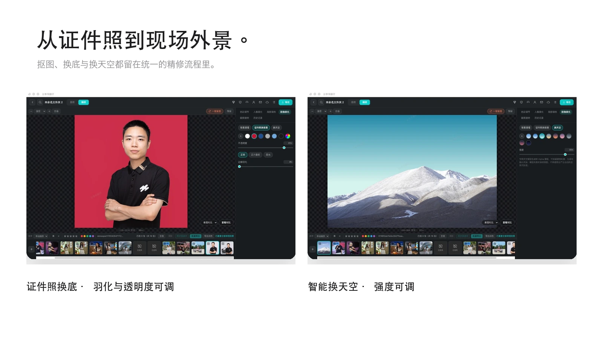
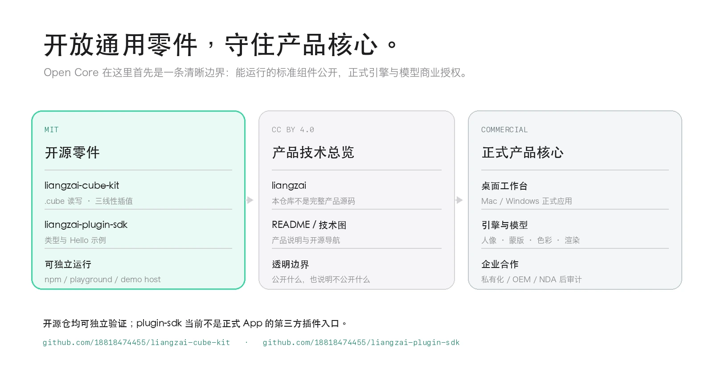

<p align="center">
  
</p>

<p align="center">
  <a href="./README.md"><b>简体中文</b></a>
  &nbsp;·&nbsp;
  <a href="./README_EN.md">English</a>
  &nbsp;·&nbsp;
  <a href="./CHANGELOG.md">更新记录</a>
  &nbsp;·&nbsp;
  <a href="./ROADMAP.md">公开路线图</a>
</p>

<p align="center">
  <a href="https://github.com/18818474455/liangzai/releases"></a>
  <a href="https://github.com/18818474455/liangzai/actions/workflows/docs.yml"></a>
  <a href="./LICENSE"></a>
  
  
</p>

<p align="center">
  <a href="https://oss.ybpbyxc.com/uploads/2026-08-17/chroma-studio-0.1.19-build27-arm64.dmg"><b>Mac · Apple Silicon</b></a>
  &nbsp;·&nbsp;
  <a href="https://oss.ybpbyxc.com/uploads/2026-08-15/chroma-studio-0.1.19-build26-x64.exe"><b>Windows · x64</b></a>
  &nbsp;·&nbsp;
  <a href="./docs/readme/media/product-tour-720p.mp4?raw=1">完整实机录屏</a>
  &nbsp;·&nbsp;
  <a href="#开放通用零件守住产品核心">开源组件</a>
  &nbsp;·&nbsp;
  <a href="https://www.ybpbyxc.com/enterprise.html">企业合作</a>
</p>

<p align="center">
  <sub>Local-first event photography retouching · Editable AI parameters · Mac / Windows</sub>
</p>

> [!IMPORTANT]
> `liangzai` 是云享传靓仔的产品技术总览与开源导航，不是完整桌面应用源码。可运行的通用组件采用 MIT；本仓文档与技术图采用 CC BY 4.0；正式修图引擎、模型与风格配方属于商业产品。

## 先看效果，再决定

<p align="center">
  
</p>

| 直接使用 | 开发者试跑 | 参与项目 |
|:---|:---|:---|
| [下载 Mac 正式版](https://oss.ybpbyxc.com/uploads/2026-08-17/chroma-studio-0.1.19-build27-arm64.dmg) · [下载 Windows 正式版](https://oss.ybpbyxc.com/uploads/2026-08-15/chroma-studio-0.1.19-build26-x64.exe) | [在线体验 `.cube` LUT 引擎](https://18818474455.github.io/liangzai-cube-kit/) · [`npm` 安装](https://www.npmjs.com/package/liangzai-cube-kit) | [讨论与问答](https://github.com/18818474455/liangzai/discussions) · [提交建议](https://github.com/18818474455/liangzai/issues/new/choose) |

如果你关心本地优先的活动摄影工作流、可编辑 AI 修图，或者希望跟进开源 LUT / 插件工具，欢迎 **Star**；版本发布、公开测试与可贡献任务会持续记录在本仓库，不用靠营销群获取更新。

## 四分钟，看完整精修过程

<a href="./docs/readme/media/product-tour-720p.mp4?raw=1">
  
</a>

真实软件界面，完整录屏压缩为 H.264 720p（04:11，约 3.8 MiB）。[点击播放或下载视频](./docs/readme/media/product-tour-720p.mp4?raw=1)。

## 为活动现场而设计

婚礼、会议、展会与证件照现场最怕两件事：网络不稳定，AI 结果又无法继续修改。云享传靓仔把精修主链路留在桌面端，让 AI 负责起稿，让摄影师保留最后决定权。

| Local-first | Editable AI | One workflow |
|:---|:---|:---|
| 解码、分析、参数与渲染在本机完成 | AI 输出可见参数，不是烤死的结果图 | 导入、精修、同步、导出在同一工作台 |
| 授权校验不携带图像；照片回传由用户主动选择 | 参数可回退、微调、复制到同场照片 | 星标、旗标、颜色标记与批量同步不改原图 |

### 一条现场工作流

**导入照片 → 本机分析 → AI 起稿 → 人工精修 → 批量同步 → 本地导出 / 用户主动回传**

- 从本地文件夹工作，或把云空间照片下载到本机。
- 通过星标、旗标和颜色标记整理一场照片，不删除原图。
- 在色彩、人像、局部蒙版与图像美化之间继续调整。
- 把同一套参数同步到同场照片，按需要导出或回传。

## 技术核心

### 01 · Local-first：精修主链路在本机

<p align="center">
  
</p>

本地照片与用户下载的相册照片进入桌面端后，解码、图像分析、参数工作栈、预览和最终导出均在本机完成。网络只承担窄范围授权，以及用户主动选择的云空间同步；“本机处理”不等于“永不联网”，边界在图中明确分开。

### 02 · Editable AI：AI 建议，用户决定

<p align="center">
  
</p>

AI 给出曝光、白平衡、HSL、曲线与风格强度等参数起点。摄影师可以继续调整、撤销、复制和批量同步；预览与导出共享参数语义和渲染逻辑，AI 不会把修改空间烤进一张不可逆的 JPG。

### 03 · Multi-model：多任务感知汇入同一工作栈

<p align="center">
  
</p>

人脸、人像区域、主体 / 背景 / 天空蒙版与全局色彩不是彼此割裂的按钮。各模块只负责自己的感知任务，输出区域与参数，再由工作栈完成全局层、局部层和统一合成。这里公开的是模块关系，不公开模型结构、权重、风格配方或核心算法。

## 真实界面，真实控制权

<p align="center">
  
</p>

<p align="center">
  
</p>

<p align="center">
  
</p>

<details>
<summary><b>展开正式版精修能力</b></summary>

### 色彩与影调

- 曝光、对比度、高光、阴影、白色、黑色
- 色温、色调、自然饱和度、饱和度
- 纹理、清晰度、祛雾、锐化、降噪、暗角与镜头畸变
- 8 段 HSL、曲线、分离调色、标准 `.cube` LUT 与强度控制

### 人像与作用域

- 磨皮、去油光、去黑眼圈、磨颈、美白与红润
- 多路脸型与五官调整、身体比例调整
- 所有人 / 女 / 男 / 儿童 / 单人作用域

### 局部与图像工具

- 主体、背景、天空、皮肤、嘴唇、眼瞳等区域蒙版
- 画笔、线性渐变、径向渐变、颜色范围、亮度范围
- 多层蒙版、独立参数、透明度与羽化
- 证件照换底、智能换天空、背景清理、裁剪与旋转

</details>

## 开放通用零件，守住产品核心

<p align="center">
  
</p>

这里的边界是“**开放标准零件 + 透明产品关系 + 商业核心授权**”，不是把总览仓包装成完整应用源码。两个公开仓都能独立运行，但 `liangzai-plugin-sdk` 当前不是正式 App 的第三方插件加载入口。

### `liangzai-cube-kit` · MIT

Adobe `.cube` 3D LUT 读写、三线性插值、强度混合与教科书级基础色彩。可在浏览器 [在线试跑](https://18818474455.github.io/liangzai-cube-kit/)。

```bash
npm install liangzai-cube-kit
```

```ts
import { parseCube, applyCubeToRgba8 } from 'liangzai-cube-kit'

const pixels = applyCubeToRgba8(parseCube(cubeText), rgba8, 0.8)
```

[查看源码](https://github.com/18818474455/liangzai-cube-kit) · [npm](https://www.npmjs.com/package/liangzai-cube-kit) · [Playground](https://18818474455.github.io/liangzai-cube-kit/)

### `liangzai-plugin-sdk` · MIT

插件清单、宿主类型与 Hello 示例，用来展示接口边界；它不能编译出成片，也不包含修图引擎、模型或风格 LUT。

```bash
git clone https://github.com/18818474455/liangzai-plugin-sdk.git
cd liangzai-plugin-sdk
npm install
npm start
```

[查看源码与 Hello 示例](https://github.com/18818474455/liangzai-plugin-sdk)

## 正式交付与可复核证据

- **Mac**：当前正式包面向 Apple Silicon / M 系列，已通过 Apple Developer ID 签名与公证。
- **Windows**：当前正式包面向 x64；尚无 Authenticode 证书，首次安装可能出现 SmartScreen 提示。
- **数据边界**：精修主链路在本机；云空间同步只有在用户选择时发生。
- **性能数字**：在公开可重复的测试方法与原始结果准备好之前，不发布无法复核的速度或精度数字。

<details>
<summary><b>当前正式安装包与校验值（核对于 2026-08-17）</b></summary>

### Mac · 0.1.19 build 27 · Apple Silicon

- [下载已公证 DMG](https://oss.ybpbyxc.com/uploads/2026-08-17/chroma-studio-0.1.19-build27-arm64.dmg)
- SHA-256：`4f1a24217363e2d861aa13ebe820d7d03850ce58dd94307e47bd39a4b7f09844`

### Windows · 0.1.19 build 26 · x64

- [下载 EXE](https://oss.ybpbyxc.com/uploads/2026-08-15/chroma-studio-0.1.19-build26-x64.exe)
- SHA-256：`8bd82700864ff67baf5cbd5a34db8a903bafa538ba5ba382f870c5e5b9cdb84e`

</details>

> [!NOTE]
> 主页中的「AI工具箱」「选片交付」仍是规划入口，本 README 不把它们作为当前正式能力宣传。Mac Intel x64 也不是当前公证 GA 目标。

## 参与与关注

这个总览仓接受产品体验反馈、兼容性报告、文档修正和公开组件建议。开始前请阅读 [贡献指南](./CONTRIBUTING.md) 与 [公开路线图](./ROADMAP.md)。

- 遇到可复现问题：[提交 Bug](https://github.com/18818474455/liangzai/issues/new?template=bug_report.yml)
- 有真实工作流需求：[提交功能建议](https://github.com/18818474455/liangzai/issues/new?template=feature_request.yml)
- 想先交流使用方式：[进入 Discussions](https://github.com/18818474455/liangzai/discussions)
- 发现安全或隐私问题：请按 [安全策略](./SECURITY.md) 私下报告，不要公开图片、账号或授权信息

`good first issue` 会优先选择文档、示例和开放组件范围内可独立完成的任务。正式桌面引擎、模型和风格配方不通过 Pull Request 开放。

## 联系、下载与许可

<table>
  <tr>
    <td align="center" width="50%">
      <a href="./docs/readme/media/wechat-qr.png?raw=1">
        
      </a>
      <br><br>
      <b>微信 · 陈影留白</b>
      <br>
      <sub>扫码添加为好友</sub>
    </td>
    <td align="center" width="50%">
      <a href="https://github.com/18818474455/liangzai">
        
      </a>
      <br><br>
      <b>Mac / Windows 下载入口</b>
      <br>
      <sub>扫码进入产品页，首屏提供当前正式安装包</sub>
    </td>
  </tr>
</table>

- 产品与官网：[ybpbyxc.com](https://www.ybpbyxc.com)
- 企业私有化 / OEM / 二次开发：[企业合作](https://www.ybpbyxc.com/enterprise.html)
- WhatsApp：`@biandongdev`
- 微信：`cylbaw` · 或扫描上方二维码添加「陈影留白」
- 商务邮箱：`007007007@163.com`
- 协议反馈：`xiaopangnanhai@qq.com`
- 公司：长沙粤北偏北传媒有限公司

本仓库文档与展示资产采用 [CC BY 4.0](https://creativecommons.org/licenses/by/4.0/)。`liangzai-cube-kit` 与 `liangzai-plugin-sdk` 的 MIT 许可仅覆盖各自仓库中的开源代码；云享传靓仔桌面应用、修图引擎、模型与风格配方不在该授权范围内。
